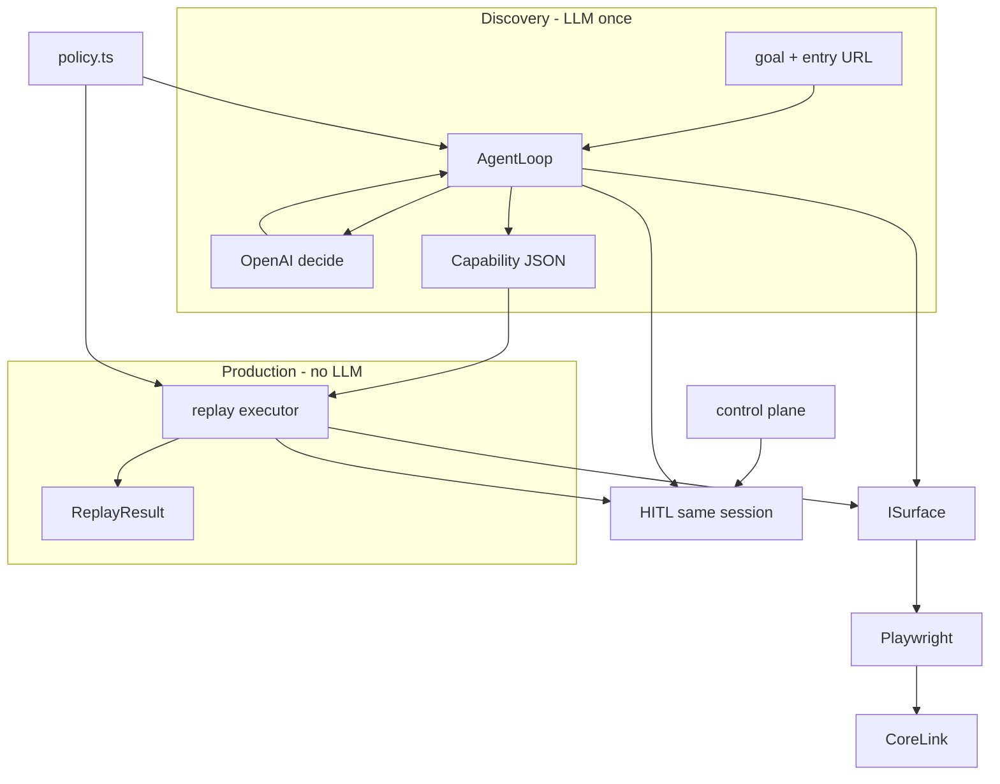
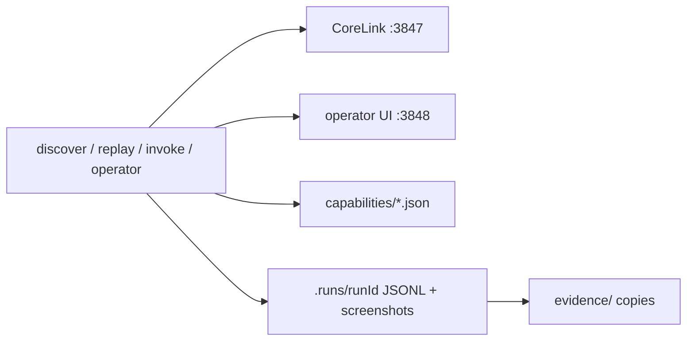
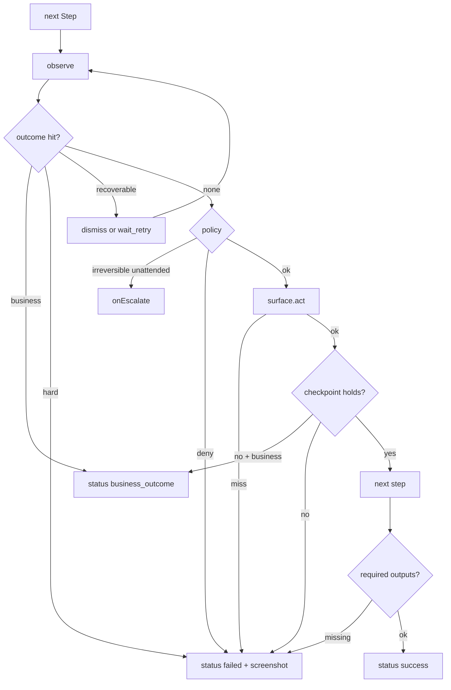
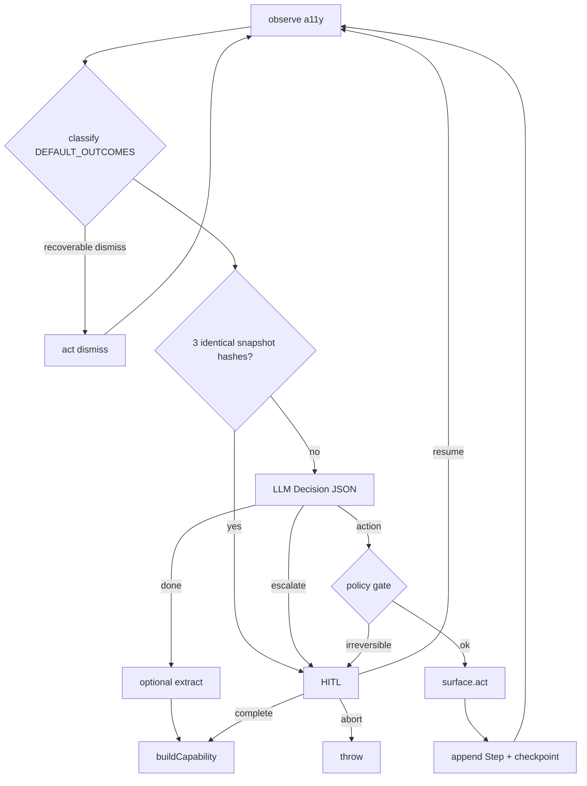

# REPORT

Vertical slice, not a platform. Single-process TypeScript CLI plus a local CoreLink stand-in. Four seams, not four services. The product split is load-bearing: **LLM once at discovery; replay never calls a model.**

## 1. Architecture

Legacy bank UIs have no API. An upstream agent should invoke a **typed tool**, not drive a browser. Discovery records that tool as a JSON capability. Production is a deterministic interpreter over that artifact. When the interpreter cannot proceed safely, a human takes the **same live Playwright session** and hands it back.



### Four seams

**Surface** (`src/surface/types.ts`) — `ISurface` is the only thing that sees a browser: `observe()` → `Perception` (a11y tree + flattened snapshot + dialogs + uri/title); `act(ProposedAction)` → `ActResult`; screenshot, `bringToFront`, human recording, `dispose`. Playwright/web is one adapter (`src/surface/browser.ts`). Desktop (`surfaceKind: "desktop"`) is in the Zod enum only — no adapter. The artifact never stores CSS or Playwright locators.

Locators are a11y-first strategies in `src/artifact/schema.ts`: `role`, `title`, `name_attr`, `near_text`, `row_cell`. Resolver in `src/surface/locators.ts` tries them in order with a short visible wait; first hit wins; matched strategy is logged. `row_cell` resolves column by **header text**, not `nth-child` — servicing screens reorder columns per tenant.

**Capability** (`src/artifact/schema.ts`) — the agent-invocable contract. Discovery writes it; replay is the only production path. Store: `src/artifact/store.ts` — `capabilities/<id>.v<n>.json`.

**Policy** (`src/safety/policy.ts`) — host/action allowlist and irreversible gating wrap *both* loops. The model cannot navigate off-box; replay cannot click Confirm unattended unless policy says so.

**Control plane** (`src/escalation/control.ts`) — a per-run lock (`automation` | `human`), an intervention record, and a resume signal. The browser process stays up across the handoff. Files under `.runs/<runId>/`: `control.json`, `intervention.json`, `resume.json`, `human-actions.json`. Handoff (`src/escalation/handoff.ts`) raises the lock, starts the mock operator UI on `:3848`, `bringToFront`s the same Playwright page, waits.

Trade-off: no queue, no tenant router, no CDP-sidecar fleet. The assignment is a vertical slice; those are scaling problems, not design problems. The cost is that a real operator console would attach to a hosted session instead of `localhost:3848` — the lock + intervention + resume files are the portable part.

Discovery uses an LLM once. Replay never calls one. That split is the product.

### Runtime topology

All local. No queue, no DB, no auth, no CI, no Docker.



| Process | Port | Code |
| --- | --- | --- |
| CoreLink mock teller | 3847 | `src/target/server.ts` |
| Operator mock console | 3848 | `src/escalation/operator.ts` |
| Replay / discover | CLI | `src/cli/` |

`ensure-target` auto-starts CoreLink if `/health` fails. `invoke` is a thin catalog: `list` prints contracts; `call` **spawns** `npm run replay` (`src/cli/invoke.ts`).

### Invariants

1. Replay path never imports or calls the LLM client.
2. Artifacts never contain CSS selectors or generated IDs.
3. Concrete PII/IDs are param refs, not literals in steps.
4. "No such member" is `business_outcome`, never `failed`.
5. Irreversible + unattended → HITL or fail-closed; never silent click.
6. Navigation off the host allowlist is rejected in **both** loops.
7. Handoff does not spawn a second browser; the Playwright page stays up.
8. Evidence is redacted JSONL + screenshots under `.runs/`, copied to `evidence/` for the demo.

## 2. Artifact schema

A capability is a **tool**, not a transcript. `schemaVersion` + `id` + `version` give review and rollback. `contract.params` / `contract.outputs` are the calling convention an upstream agent uses. Steps are ordered actions with:

- **Multi-strategy locators**, a11y-first: `role+name`, then `title` (legacy tooltip-as-name), `name_attr` (what the vendor actually shipped), `near_text` (unlabeled table cell), `row_cell` (header-aligned extract). CSS and generated IDs are absent on purpose.
- **Value refs** (`param` | non-sensitive `literal` | `empty`) so member IDs never bake into the flow.
- **Checkpoints** after mutating steps — “the click worked” is not a success condition.
- **Outcome detectors** with kind `business` | `recoverable` | `hard`. This is the load-bearing distinction: “no such member” is a result; a missing Search button is a failure; a maintenance dialog is a recover-and-continue.

| Field | Role |
| --- | --- |
| `schemaVersion` + `id` + `version` | Review / rollback |
| `contract.params` / `contract.outputs` | Calling convention for `npm run invoke` |
| `steps[]` | Ordered actions + multi-strategy locators + value refs + checkpoints |
| `outcomes[]` | Detectors: `business` / `recoverable` / `hard` |
| `success` | Required checkpoint IDs + required outputs |
| `vendor` + `tenantOverrides` | Schema for later overlay; **replay does not apply overlays today** |
| `policy` | Host/action allowlist + irreversible flag, copied onto the artifact |

`vendor.base` + `tenantOverrides` are in the schema now so a later overlay can patch locators/entry without forking the flow. Discovery leaves them empty. Seeded example: `capabilities/lookup-savings-balance.v1.json`.

Why JSON + Zod rather than a DSL: reviewers (human and model) can read it; the runtime can validate it; it diffs in git.

## 3. Determinism & error handling

Replay (`src/replay/executor.ts`) is a straight interpreter. **No model.** For each step: observe → classify outcomes → policy check → act → checkpoint.



**Locators.** Strategies are tried in order with a short visible wait. The first hit wins; the matched strategy is logged so we can promote it. `row_cell` resolves the column by header text, not `nth-child`, because servicing screens reorder columns per tenant.

**Waits.** Playwright actionability is the default. We do not wait on `networkidle` (legacy postbacks lie). Checkpoints are the real barrier.

**Taxonomy.** Replay contract is `src/replay/result.ts`.

| Kind | Example | Replay contract |
| --- | --- | --- |
| `success` | Balance extracted, checkpoints held | outputs returned |
| `business_outcome` | member not found, validation, permission denied | `outcome.id` + message, not an exception |
| `recoverable` | System Notice interstitial | dismiss / wait-retry, then continue |
| `hard` | session expired, locator miss after retries | `failed` with step, expected, observed, screenshot |
| `escalated` | Human aborted or did not resume | lock released, fail-closed |

UI drift is secondary here (enterprise consoles move slowly). When it happens it shows up as a locator miss with the tried strategies and a screenshot — then HITL, not a silent skip.

### Discovery loop

Discovery (`src/agent/loop.ts`) is the one place a model runs. The model sees a flattened a11y snapshot, not pixels. `src/agent/llm.ts` prefers Gemini (`GEMINI_API_KEY`) and falls back to OpenAI. Set `LLM_PROVIDER=openai` to force OpenAI when both keys exist. Replay still never calls a model.



- Fill values that match inferred goal params become `{ kind: "param" }`.
- Click/fill get a checkpoint from post-action url/title.
- `buildCapability` (`src/artifact/builder.ts`) attaches default outcome detectors (not-found, denied, session expired, system notice).

## 4. Heterogeneity & multi-tenant

**Surfaces.** The artifact speaks role/name/row, not DOM. A desktop adapter (macOS AX / Windows UIA) would implement `ISurface.observe/act` against the same locator kinds. Web-only strategies (`name_attr`) stay at the end of the list so they degrade instead of blocking a port. Screenshot+coordinates were rejected as primary control: they encode a resolution and a theme, which is exactly what branded tenants change.

**Tenants.** Hundreds of institutions run ~20 vendor products. The unit of reuse is `vendor.product` + capability id, not “First Oak’s recording.” Record against a reference tenant (or the vendor’s UAT). Ship that as `vendor.base`. Per tenant:

1. Replay on a canary with the base artifact.
2. On locator miss, a bounded overlay (`tenantOverrides.locatorPatches`) — not a new recording.
3. If checkpoints fail because of copy/branding, patch detectors, not steps.
4. Version the vendor channel (`appVersion`); pin artifacts to it. Drift detection is “canary replay status over N accounts,” not visual diff.

What we would *not* do: clone the artifact per institution, or put tenant hostnames in steps (entry URL is override-scoped).

`tenantOverrides` is **schema-only today**. Replay does not apply overlays at runtime.

## 5. Escalation & handoff

Stuck is detected, not hoped: unchanged a11y hash for 3 turns, model `escalate`, policy `irreversible` in unattended mode, locator miss, max steps.

Control transfer is a lock, not a new browser:

1. Automation sets `owner=human`, writes `intervention.json` (goal, step, reason, snapshot excerpt, screenshot).
2. Operator UI (`/operator?run=`) is a mock console. The **session** is real: the same Playwright page stays open; `bringToFront` + click/change listeners record what the human did.
3. Human signals `resume` | `complete` | `abort` (UI, or `npm run operator -- resume --run …`).
4. Automation re-acquires the lock and either continues, accepts completion, or fails closed.

`--force-escalate --auto-resume` is the unattended demonstration of that seam. A real co-browse product would replace the HTML page with their existing operator tool; it would still speak this lock.

## 6. Safety

Allowlist is host + action + blocked path prefixes (`/wire`, `/ach/send`, `/admin/delete`). Discovery and replay share `checkNavigation` / `checkAction`. Host allowlist in the demo is `127.0.0.1` / `localhost`.

Irreversible (confirm / open account / transfer / delete, inferred from the step description) **escalates** in unattended replay. Gate: `risk === "irreversible"` + `unattended` + `!allowIrreversibleUnattended` → escalate, do not act. Safe/reversible proceeds. I would rather stall a teller workflow than post a sub-account because a locator drifted onto Submit.

Redaction (`src/safety/redact.ts`): SSN/PAN/email/bearer/password keys never land in JSONL. Identifiers are masked in logs; artifacts store param refs. Limits: the capability *result* still returns the balance to the caller — that is the point of the tool. Production would add field-level encryption at rest and a data-class on every extract. Demo members are synthetic.

The agent cannot be prompted into `https://evil`. It can still fill a field on an allowlisted host with a value that is operationally stupid; that’s a capability-review problem, not a runtime allowlist problem.

## 7. CoreLink fixture

Not a product. It forces the hard cases the artifact must encode (`src/target/`).

| Member / flag | Outcome kind |
| --- | --- |
| `12345` Jane Doe, Savings `$4,250.18` | success |
| `22222` Robert Chen | success |
| `88888` | `business` permission denied |
| `99999` | `business` not found |
| First visit cookie | `recoverable` System Notice interstitial |
| `/?expire=1` | `hard` session expired |

UI traits: table layout, `title=` as accessible name, `name="member_id"`, no test IDs, interstitial overlay. Sub-account / irreversible path exists in the target HTML; **no capability is recorded for it**.

## 8. Cuts

**In and tested:** schema, Playwright surface, locator resolver, discovery (Gemini, OpenAI fallback), replay executor, outcome taxonomy, policy, redaction, HITL lock + operator page, CoreLink, one seeded capability, Vitest including replay e2e (`12345` / `99999` / `88888` / expire).

**In schema or docs, not runtime:** `tenantOverrides` application, desktop `ISurface`, Anthropic, `draft → approved` gate, credential broker, canary overlay compiler.

Left out on purpose: desktop adapter, real co-browse, queues, auth-broker / credential vault, multi-run flakiness scores, LLM one-step recovery on replay miss, visual regression.

Would build next: (1) credential broker so session expiry can recover without putting secrets in artifacts, (2) canary replay + tenant overlay compiler, (3) approval state (`draft → approved`) before unattended production invoke.

Stretched one thing: `npm run invoke -- list|call` as the agent-facing catalog. Everything else stayed thin.

## 9. Demo path

```bash
npm test
npm run replay -- --artifact lookup-savings-balance --params memberId=12345
npm run replay -- --artifact lookup-savings-balance --params memberId=99999
npm run replay -- --artifact lookup-savings-balance --params memberId=88888
npm run replay -- --artifact lookup-savings-balance --params memberId=12345 --expire
npm run replay -- --artifact lookup-savings-balance --params memberId=12345 --force-escalate --headed --auto-resume
```

Discovery (`npm run discover`) needs `GEMINI_API_KEY` (or `OPENAI_API_KEY`). Everything else does not.
